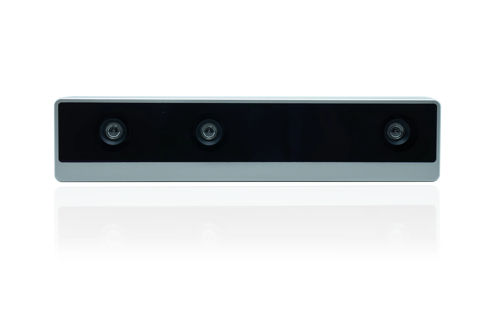
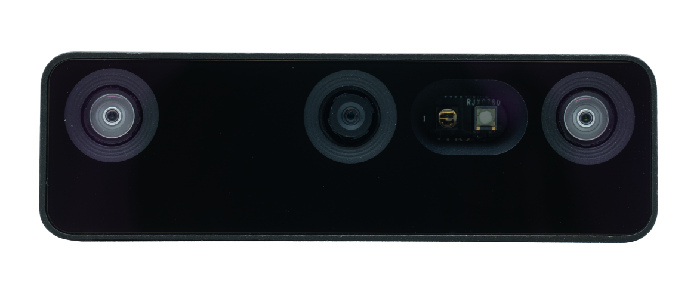
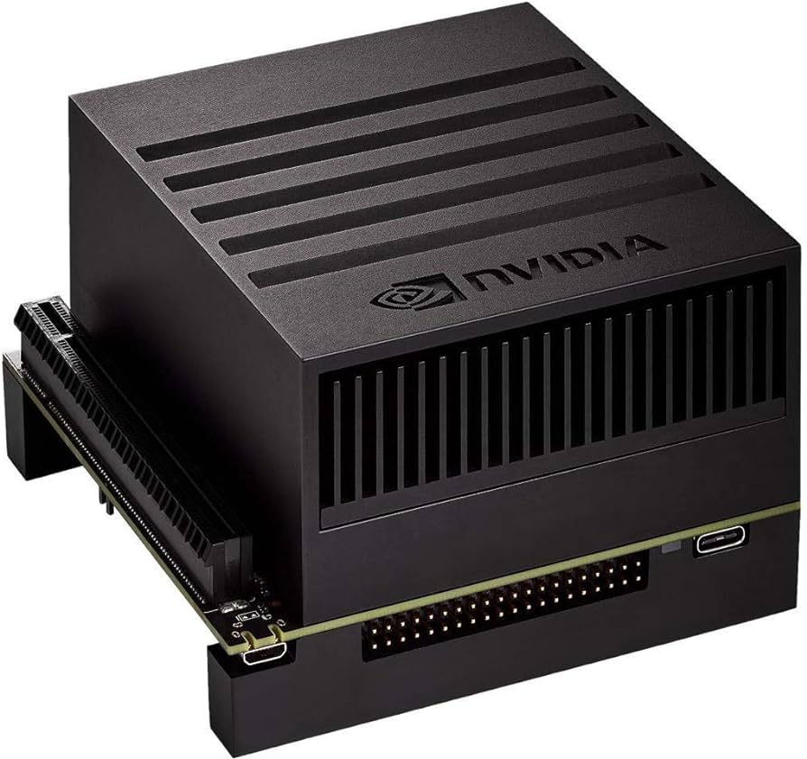
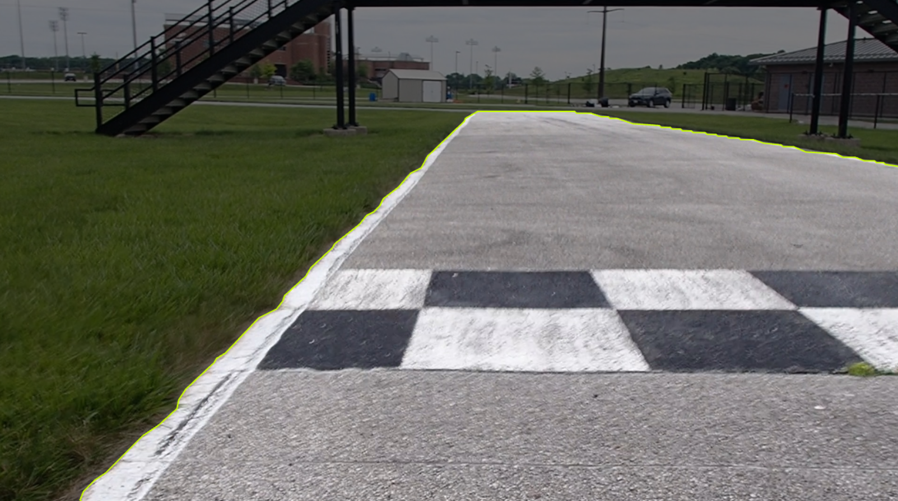

# Track Detection Using Deep Learning

by Devin Pham and Grace Chen


Click [here](#ros-integration) to learn how to run ROS package on OSSDC-SIM

## Introduction

During the Winter and Spring quarters at UCSD in 2024, we were given the special opportunity to develop a track detection algorithm to be used in the [Autonomous Karting Series](https://www.autonomouskartingseries.com/) (AKS), a competition in which a number of universities came together to race autonomous electric go-karts. Due to various mechanical issues that we had with our go-kart, we were unable to test this algorithm and instead used [Donkeycar](https://github.com/Triton-AI/donkeycar). Unfortunately, the Donkeycar algorithm fell short of our expectations as the go-kart was unable to complete the entire track during the race. Because the algorithm we developed was able to make the go-kart complete the track without PID tuning on a simulator, we believe that a guide detailing the machine learning pipeline that we used would be of value to students who will be competing in an autonomous race like AKS or are simply interested in learning about deep learning and computer vision. To ensure that future teams have a solid foundation to build upon our work, we made an effort to make this guide as comprehensive as possible.

## Objectives
1. Create an algorithm that is able to detect the [Purdue Grand Prix Track](https://maps.app.goo.gl/f2X3zkNxbXbzi7fP6) using a camera mounted on the go-kart. This algorithm must be able to run directly on the camera itself or an NVIDIA Jetson module
2. Integrate algorithm with ROS driving controls to make the go-kart drive reactively (without pre-mapping)

## Resources Provided
1. [Luxonis Oak-D LR](https://shop.luxonis.com/products/oak-d-lr)

    

    Source: https://shop.luxonis.com/products/oak-d-lr

    The Luxonis Oak-D LR, with “LR" standing for “long range”, is the main camera affixed to the front of our go-kart. It uses the left and right lenses for depth perception, while the middle lens functions as a color camera. For our purpose, we only used the color camera with less computational power.
     
    The full list of specifications for this camera can be found [here](https://docs-old.luxonis.com/projects/hardware/en/latest/pages/OAK-D-LR/). The main details to note about the color camera is that it has a 16:10 aspect ratio, 1200P resolution, and a maximum FPS of 30. In  order to run our model on this camera at the maximum FPS, we had to lower our resolution to something like 200P. We will provide more details to this augmentation later in the guide.

2. [Oak-D Pro W](https://shop.luxonis.com/products/oak-d-pro-w?variant=43715946447071)
    

    Source: https://shop.luxonis.com/products/oak-d-pro-w?variant=43715946447071

    [Oak-D Lite](https://shop.luxonis.com/products/oak-d-lite-1?variant=42583102456031)

    

    Source: https://shop.luxonis.com/products/oak-d-lite-1?variant=42583102456031

    These two cameras were used primarily for prototyping purposes for when we were unable to test using the LR. Two Oak-D Pros could potentially be pointed to the left and right of the go-kart for additional inference; This was what the [Donkeycar](https://github.com/Triton-AI/donkeycar) algorithm used during the our race.

3. [NVIDIA Jetson AGX Xavier](https://www.nvidia.com/en-us/autonomous-machines/embedded-systems/jetson-xavier-series/)

    

    Source: https://www.amazon.com/NVIDIA-Jetson-Xavier-Developer-32GB/dp/B083ZL3X5B

    We intended on deploying our model usign this computer module instead of running it directly ont he camera. The Jetson's GPU and specialized hardware accelerators allows it to make much faster inferences than running on a CPU. We did not get a chance to deploy our ROS package, but you can find instructions on how to do that [here](https://developer.nvidia.com/embedded/learn/getting-started-jetson).


4. LIDAR

    We did not utilize LIDAR in our algorithm at all, but incorporating it could potentially enhance performance, considering its widespread use in today's autonomous vehicles.

5. [OSSDC SIM](https://github.com/OSSDC/OSSDC-SIM.git)

    

    OSSDC SIM (Open Source Self Driving Car Simulator) is an open-source platform used to simulate the driving of autonomous cars and go-karts. Using a simulator is a cost-effective, safe, and scalable way to test autonomous vehicles that allows for rapid prototyping.

## Unsuccessful Attempts

Most of our failed attempts were from trying to use past repositories that specialized in lane detection. Most of these models used traditional computer vision methods using [OpenCV](https://opencv.org/about/), an open source computer vision and machine learning software library, which took a lot of effort to tweak as most of the code available online were outdated and/or had parameters that were difficult to adjust.

Something that we overlooked was that our model needed to differentiate between road and grass instead of lane and road. Most of the models we saw online differentiated between lane and road instead of road and grass (Note the distinction between *lane* detection and *road*/*track* detection). 
Using traditional computer vision methods also made track detections less robust in direct sunlight which is the main reason why we switched over to use deep learning instead of purely using computer vision techniques. Our race took place at around noon time so direct sunlight was a big issue.

## Introduction to Roboflow

Roboflow is a web-based platform that allows developers to easily annotate images and deploy models for computer vision applications. If you are new to computer vision, annotation is the practice of labeling training data, which in our case, are images. Annotations can be in the form of bounding boxes (in the context of object detection), or masks (in the context of segmentation). This is usually a manual process, but it can be made faster through the use of pre-trained models and LLMs.

For track detection we will be focusing on segmentation instead of object detection. Segmentation is different from object detection in that we are not only identifying objects within an image, but we are also detecting the exact boundaries of each object at the pixel level. 

It is also important that we differentiate between the two types of segmentation: instance segmentation and semantic segmentation. Instance segmentation is able to distinguish between separate instances of the same class, while semantic segmentation does not. Although it is more computationally expensive, we will be using instance segmentation since it offers support for more models.


Source: https://www.folio3.ai/blog/semantic-segmentation-vs-instance-segmentation/

Roboflow offers many options for model generation either directly through their platform or through Google Colab/Jupyter Notebooks. At the time this guide was written, the default model that Roboflow offers is called “Roboflow 3.0 Instance Segmentation”, and it is available directly through their platform. Because there are [no details provided about this model](https://discuss.roboflow.com/t/what-is-behind-the-roboflow-3-0-instance-segmentation-model/3720) or options to customize this model, we will be using the YOLO models available via their provided notebooks. YOLO (You only look once) is a state-of-the-art deep learning framework that enables real-time object detection and segmentation in images or videos.

## Data Collection

Here is a map of the track we raced on along with labels that designate areas of interest:


We did not get a chance to collect training data when we were on the track in Purdue, but these were the videos we planned on taking. Roboflow allows you convert these video clips to frames that you can use to annotate:

1. `track_center.mp4` - Push the Go-Kart down the center of the track (30 FPS)
2. `track_left.mp4` - Push the Go-Kart down the left side of the track (30 FPS)
3. `track_right.mp4` - Push the Go-Kart down the right side of the track (30 FPS)
4. `pit_center.mp4` - Push the Go-Kart into the pit exit all the way into the cones while staying at the center of the track (30 FPS)
5. `pit_left.mp4` - Push the Go-Kart into the pit exit all the way into the cones while staying at the left side of the track (30 FPS)
6. `pit_right.mp4` - Push the Go-Kart into the pit exit all the way into the cones while staying at the right side of the track (30 FPS)

Batches are groups of frames that are to be annotated. We will also list the batches that we planned on creating:

| Batch Name        | Instructions                                      | FPS |
|-------------------|---------------------------------------------------|-----|
| Track Center      | Upload `track_center.mp4` as is                    | 1   |
| Track Left        | Upload `track_left.mp4` as is                      | 1   |
| Track Right       | Upload `track_right.mp4` as is                     | 1   |
| Track Center (Pit)| Upload only the pit (exit) part of `track_center.mp4` | 30  |
| Track Left (Pit)  | Upload only the pit (exit) part of `track_left.mp4` | 30  |
| Track Right (Pit) | Upload only the pit (exit) part of `track_right.mp4` | 30  |
| Pit Center        | Upload `pit_center.mp4` as is                      | 30  |
| Pit Left          | Upload `pit_left.mp4` as is                        | 30  |
| Pit Right         | Upload `pit_right.mp4` as is                       | 30  |

We recommend collecting video footage using the camera that will be used on the Go-Kart so that the images trained are closest to the images being inferred on. We were unable to do this so we used [video footage](https://drive.google.com/drive/folders/1r7gLjh1-zUZEpc8-N0tE4WDk9jHMvr5w?usp=sharing) provided by our Professor instead.

## Getting Started With Roboflow

### Account Setup

1. Use one of the three options (Google account, GitHub, or email) to create an account. Enter in your personal information, create a password, and accept the Terms of Service and Privacy Policy
2. Name your workspace, choose the free plan, and press "Create Workspace". A workspace is a folder in which all of your projects will be at


### Creating a New Project

1. In your workspace, press "Create New Project" on the upper right 
2. Enter in a project name and type in "Track" for the annotation group 
3. Select "Instance Segmentation" for the project type 
4. Click on "Create Public Project"


5. Go to the "Classes" tab on the sidebar at the left. Type in the "track" class, and click "Add Classes". Click "Save and Continue"

### Uploading Data

1. Go to the "Upload Data" tab on the sidebar at the left
2. Select your video footage
3. Crop video and adjust FPS as needed
4. Wait for data to process


## How to Annotate Images

In summary, we want to annotate the track all the way to the solid/dashed line and the cones, while excluding the pit. 

Here is a step-by-step guide on what we found was the best way to annotate based on our own experimentation:
1. Use the "Smart Polygon" tool and click on the part of the track that is the directly in front of the Go-Kart. If you are annotating the corner that includes the pit, ignore steps 2-4 and manually label using the "Polygon Tool" instead. Also, look at the second bullet points under "Tips"
2. Click only on the left and right of the track for a few clicks to get more of the track. (Do not click further to the front)
3. Once you have finished the annotations, go to the drop down menu on the upper left, select the "track" class, and hit "enter"
4. The vertices should now pop up. If the track has not been fully selected, drag the vertices to cover the whole track (Click on lines to create more vertices and click on existing vertices to remove them)
5. Add all images to dataset when annotation is done


### Reminders

- Always select the "track" class from the drop down menu instead of manually typing them to avoid making accidental new classes (Because of typos)
- Review previous annotations to make sure every frame is annotated properly (Happened to me a couple times when my wifi connection was connection was weak and it didn't save)
- Make sure to not make multiple annotations on the same image (Go to the "layers" tab to double check)

### Tips

- Turn on hardware acceleration on your browser to make Roboflow smoother to navigate (If you are using Safari, this might be autonomatically enabled)
- Clicking "Repeat Previous" and adjusting the vertices can save time

### Examples of Good Annotations

Straights:


Simple turns:


Complex turns:

- Note how the entire track is not selected

Pit entrance:

- Note how the pit is not included

Pit exit:

- Note how the pit is not included
- Highly recommend using the standard polygon tool

### Label Automation

An extremely fast way to label that we unfortunately found out later in the class is something called "Label-Assist". This consists of taking a pre-trained model and using that to infer new annnotations.

Simply click on the wand icon on the right, select your model, select the class you want to use, and the model should automatically infer.


We are also aware that Roboflow have now enabled the use of LLMs for annotation. However, this feature is only available for object detection tasks at the moment and not segmentation.

### Generating Dataset

Once you have finished creating your dataset, the last step is to generate it. Here is a step-by-step guide on how to do that:

1. Click on "Generate" on the left sidebar
2. Click on "Create New Version"
3. Under "preprocessing", select "fit within", and select a smaller resolution of your choice. Ensure that the the resolution has the same aspect ratio as the camera you are using. Ensure that the height and width is divisible by 32 if you plan on deploying the model on an Oak-D. For our purpose, we chose 320x192 for our pre-processed resolution
4. Select augmentations. Adding augmentations will improve the performance of inference at the cost of training time. We usually just apply the following augmentations which does its best to combat direct sunlight:
```
Brightness: Between -5% and +5%
Exposure: Between -5% and +5%
```


## How to Train New Models

We worked with two different models during our time working on this project:

1. Roboflow 3.0 Instance Segmentation

    This is the default model that Roboflow offers on their platform. The main disadvantage of this model is that it can only do frame-by-frame inference, and you must have wifi connection for it to work. Roboflow also does not offer customization or details on training this model. Training this model also requires Roboflow credits which is limited for users on the free plan. 

2. [YOLOv8](https://colab.research.google.com/drive/1JTz7kpmHsg-5qwVz2d2IH3AaenI1tv0N?usp=sharing)

    Roboflow offers a straight-forward [notebook](https://colab.research.google.com/github/roboflow-ai/notebooks/blob/main/notebooks/train-yolov8-instance-segmentation-on-custom-dataset.ipynb) which outlines the steps on how to train this model. YOLOv8 only supports frame by frame detection, but this is exactly what we needed to integrate our model with ROS. The Python code on how to run these inferences are included in this notebook as well.

For the YOLO model mentioned, we highly recommend running the notebooks on Google Colab, especially if your computer does not have a dedicated GPU. Google Colab's [cloud-based GPU](https://saturncloud.io/blog/whats-the-hardware-spec-for-google-colaboratory/#:~:text=The%20default%20GPU%20for%20Colab,you%20need%20more%20computing%20power.) is extremely capable, and can train your model faster than renting a RTX 4090 from Vast.ai, for example.

It is important to change the image size (imgsz parameter) to match the width of the pre-processed resolution in the two YOLO notebooks. This will ensure accurate inference at your preferred resolution. Since our pre-processed resolution was 320x192, we put 320 for the image size.

## Camera Inference

YOLOv8 does not offer native support for on-camera inference for segmentation. However, we were able to get it to work using the instructions provided in this [repository](https://github.com/tirandazi/depthai-yolov8-segment). Please refer to this repository for more information.

## ROS Integration

[Robotics Operating System](https://www.ros.org/) (ROS) needs to be integrated with your YOLO model to enable the go-kart to drive.

Depending on ROS2, see [here](https://docs.ros.org/en/iron/Installation/Ubuntu-Install-Debians.html) for instructions to install ROS2 Iron. Remember to install the dev tools for ROS2. 

Below are instructions on how to run `track-detection-ros-ws` on OSSDC SIM:

Assuming ROS2 is sourced in your terminal

### To build:
```
# clone the repo
cd track-detection-ros-ws
colcon build
```

### To run:

In terminal 1, enter in the following commands:
```
cd ~/projects/race_common/OSSDC-SIM-ART-Linux/wise
python3 -m http.server 9090
```

In terminal 2, enter in the following commands:
```
cd ~/projects/race_common/OSSDC-SIM-ART-Linux
./start_sim_local.sh
```

In terminal 3, enter in the following commands:
```
~/projects/race_common/
tmuxP loal tools/tmux_configs/svl_iac.yaml
```

Make sure rvc in launch `autonomy_core.launch.py` is commented out

In terminal 4, enter in the following commands:
```
~/projects/race_common/
make PACKAGES=autonomy_launch
source install/setup.bash
ros2 run lane_detection lane_detection_node
```

In terminal 5, enter in the following commands:
```
source install/setup.bash
ros2 run lane_detection lane_guidance_node
```

### To stop:

Hit ctrl + c in one of the tmux windows in terminal 3.

In the same tmux window, enter in
```
tmux kill-session
```

### To make changes:

In a terminal, enter in this line if you make changes to lane detection node
```
make PACKAGES=lane_detection
```

or this line if you make changes to the lane guidance node
```
make PACKAGES=lane_guidance
```

## PID Tuning

PID tuning is the process of adjusting the parameters of a PID controller to optimize its performance in controlling a system. The goal of PID tuning is to achieve stable, accurate, and responsive control of the system's output to closely match a desired setpoint. This involves finding the right balance of proportional (P), integral (I), and derivative (D) actions to ensure effective control while minimizing overshoot, oscillations, and settling time.

Here is rough outline of the steps to tune the PID controller:

1. Set k_p, k_i, k_d to 0
2. Adjust k_p to adjust for how much the go-kart turns
3. When the go-kart is oscillating (moving side to side but still completing the track), adjust k_d to dampen the oscillations and reduce it
4. Adjust k_i to reduce the steady-state error as much as possible. Steady-state error is the difference between the system's desired state and current state 

We highly recommend watching a few YouTube videos on PID tuning to get a better understanding of control theory. We recommend [this](https://www.youtube.com/watch?v=4Y7zG48uHRo&t=164s&pp=ygUKcGlkIHR1bmluZw%3D%3D) one. 

We were unable to tune it properly in time for the race, but these were the best parameters that we were able to get:
```
k_p = 0.038
k_i = 0
k_d = 0.008
```
These parameters allowed the go-kart to complete the whole the track on the sim, but it unfortunately still oscillated. 

## Final Thoughts

We want to take this section to firstly thank the HDSI faculty for creating this class as we would not have been able to graduate on time if it was not made available. We would also like to thank Professor Jack Silberman and Raymond Song for guiding us through this capstone project. Lastly, we would like to thank Dominic Nightingale for open-sourcing his [robocar ROS package](https://gitlab.com/ucsd_robocar2/ucsd_robocar_lane_detection2_pkg) which we have adapted to integrate our model with ROS. 

## Works Cited
- Autonomous Karting Series. https://www.autonomouskartingseries.com/
- Donkeycar GitHub Repository. https://github.com/Triton-AI/donkeycar
- Luxonis Oak-D LR Camera. https://shop.luxonis.com/products/oak-d-lr
- NVIDIA Jetson AGX Xavier. https://www.nvidia.com/en-us/autonomous-machines/embedded-systems/jetson-xavier-series/
- Oak-D Pro W Camera. https://shop.luxonis.com/products/oak-d-pro-w?variant=43715946447071
- Oak-D Lite Camera. https://shop.luxonis.com/products/oak-d-lite-1?variant=42583102456031
- OpenCV. https://opencv.org/about/
- OSSDC SIM GitHub Repository. https://github.com/OSSDC/OSSDC-SIM.git
- Purdue Grand Prix Track. https://maps.app.goo.gl/f2X3zkNxbXbzi7fP6
- Roboflow. https://roboflow.com/
- YOLOv8 Google Colab Notebook. https://colab.research.google.com/drive/1JTz7kpmHsg-5qwVz2d2IH3AaenI1tv0N?usp=sharing
- YOLOv8 Roboflow Notebook. https://colab.research.google.com/github/roboflow-ai/notebooks/blob/main/notebooks/train-yolov8-instance-segmentation-on-custom-dataset.ipynb
- DepthAI YOLOv8 Segmentation Repository. https://github.com/tirandazi/depthai-yolov8-segment
- Robocar ROS Package. https://gitlab.com/ucsd_robocar2/ucsd_robocar_lane_detection2_pkg
